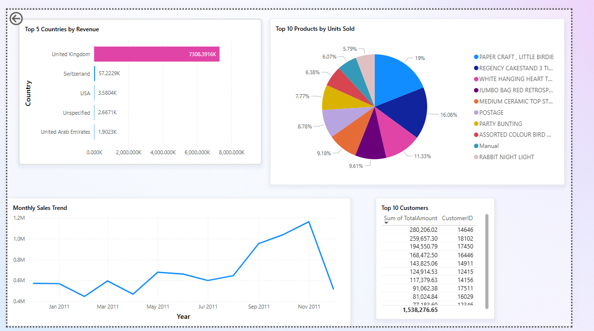
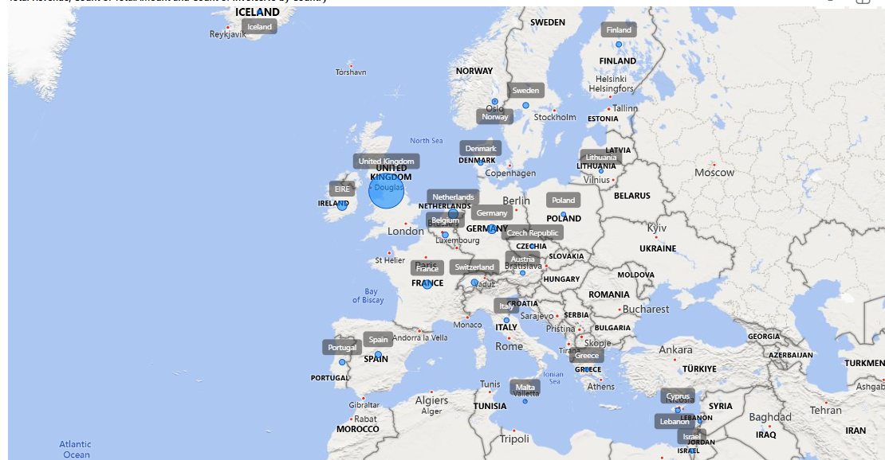

# 🧾 Online Retail ETL & Data Warehouse Project

## 📚 Project Overview

This project demonstrates the design and implementation of a **Data Warehouse (DWH)** solution for an online retail business using **SQL Server Integration Services (SSIS)** and **SQL**. The goal is to build a robust ETL pipeline to process raw transactional data, transform it into structured star schema tables, and enable meaningful insights through data analysis. An interactive dashboard has also been created for the star schema using **Power BI** to explore key business insights.

*Do not hesitate to read the report (/Support/Project_Report) for deeper exploration.*

---

## 🧱 Architecture Overview

- **Source**: CSV file of online retail transactions (Dataset Link  *https://archive.ics.uci.edu/dataset/352/online+retail*)
- **Staging Area (STA), Operational Data Store (ODS)**: Operational Data Store to clean and hold filtered transactional data
- **Data Warehouse (DWH)**: Star schema with dimension and fact tables
- **ETL Pipeline**: Built using SSIS packages and Data Flow Tasks
- **Analytics**: SQL queries to uncover business insights

---

## 🗂️ Database Structure

### 🏢 ODS Database (Raw & Cleaned Data)
| Table               | Description                                |
|---------------------|--------------------------------------------|
| `ODS_OnlineRetail`  | Cleaned transactional data (no nulls, no returns, positive quantities and prices) |

### 📦 DWH Database (Star Schema)
| Table         | Type       | Description                                      |
|---------------|------------|--------------------------------------------------|
| `DimCustomer` | Dimension  | Unique customers with ID and country            |
| `DimProduct`  | Dimension  | Unique products with code and description       |
| `DimDate`     | Dimension  | Date-related details (day, month, year, quarter)|
| `FactSales`   | Fact       | Transactional facts: quantity, unit price, totals|

---

## 🔁 ETL Process Overview

### 1. **Extraction**
- Source data is extracted from a CSV using a Flat File Source in SSIS.

### 2. **Transformation**
- Removed null CustomerIDs, negative quantities, zero prices.
- Derived `TotalAmount` = Quantity × UnitPrice.
- Created surrogate keys using lookups for dimensions.
- Used `DimDate` to break down invoice dates into Year, Month, Quarter, Day.

### 3. **Loading**
- Data is loaded to:
  - `ODS_OnlineRetail` table first
  - Then transformed and loaded into the respective DWH tables

---

## 🔍 Key Transformations

- **Data Cleansing**: Excluded records with null `CustomerID`, non-positive `Quantity` or `UnitPrice`.
- **Surrogate Keys**: Generated for each dimension.
- **Date Breakdown**: Parsed `InvoiceDate` into `Year`, `Month`, `Quarter`, `Day` for `DimDate`.
- **Distinct Values**: Ensured unique entries for customers and products.
- **Joins & Lookups**: Used to map surrogate keys from dimension tables into `FactSales`.

---

## 📊 Power BI Dashboard Integration

As an extension of the ETL project, I developed an interactive **Power BI dashboard** to visualize and explore key business insights derived from the cleaned retail dataset. The dashboard provides dynamic and intuitive charts to help stakeholders make data-driven decisions.

### 🔍 What’s Included in the Dashboard?

- 📅 **Monthly Sales Trends** – Line charts to monitor revenue fluctuations over time.
- 🌍 **Geo Sales Map** – Geographic heatmap to identify top-performing countries.
- 👤 **Top Customers** – A leaderboard showcasing high-value customers.
- 📦 **Top Products** – Insights into product performance by units sold and revenue.
- 🧮 **KPIs** – Total Revenue, Average Order Value, Number of Orders, etc.

### 🖼️ Screenshots

#### Overview Dashboard

#### Geo Sales Map

---

## 📊 Analytical Insights

### ✅ Monthly Sales Trend
> Track how revenue changed month over month.

| Year | Month | Monthly Sales     |
|------|-------|--------------------|
| 2010 | 12    | 572,698.89         |
| 2011 | 11    | 1,161,787.38       |

### ✅ Top Countries by Revenue

| Country         | Total Revenue     |
|------------------|------------------|
| United Kingdom   | 7,308,226.55     |
| Netherlands      | 285,446.34       |

### ✅ Top Customers

| CustomerID | TotalSpent |
|------------|------------|
| 14646      | 280,206.02 |
| 18102      | 259,657.30 |

### ✅ Best Selling Products

| Description                          | Total Units |
|-------------------------------------|--------------|
| PAPER CRAFT , LITTLE BIRDIE         | 80,995       |
| MEDIUM CERAMIC TOP STORAGE JAR      | 77,916       |

### ✅ Bonus Insight: Average Order Value by Customer

| CustomerID | Orders | Average Order Value |
|------------|--------|---------------------|
| 16446      | 3      | 56,157.5             |

---

## 🛠️ Tools & Technologies

- **SQL Server Management Studio (SSMS)**
- **SQL Server Integration Services (SSIS)**
- **T-SQL**
- **Microsoft Excel** (source data)
- **PowerBI**
---

## 📁 Setup Instructions

1. Create the `STA`, `ODS`, `ADM` and `DWH` databases with the /Support/Scripts folder.
2. Run the provided SQL script to create tables with `IF NOT EXISTS` logic.
3. Configure and run your SSIS packages in the following order:
   - Load CSV → `ODS_OnlineRetail`
   - Transform & Load to `DimCustomer`, `DimProduct`, `DimDate`, `FactSales`
4. Run analysis SQL scripts to extract insights.

---

## 🔄 Data Stats

- **Original Rows**: 541,909
- **Post-Cleansing Rows**: 397,884
- **Data Loss Explanation**: Removed rows with missing customers, returns (negative quantity), and zero-priced items for accuracy.

---

## 🧠 Lessons Learned

- Importance of clean, structured data before loading into DWH.
- Use of surrogate keys and lookup transformations in star schemas.
- How to design an SSIS workflow using control and data flow tasks.
- Performance benefits of pre-aggregated data in dimensional models.

---

@By gallas-ng
